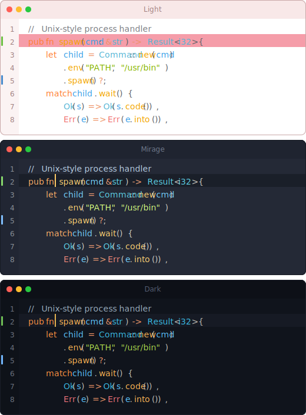

A simple theme with bright colors, available in three variants — dark, light, and mirage. 

Forked from the original ayu-theme (https://github.com/ayu-theme/vscode-ayu, original author: Ike Kurghinyan).
This repository includes additional modifications by Qiao Changliang <clqiao@gmail.com>.

## Features

- **6 color themes**: Light, Mirage, and Dark — each with bordered and unbordered variants
- **File icons**: Custom icon theme included

